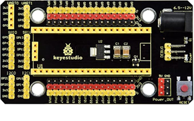
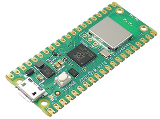
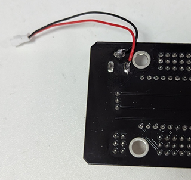
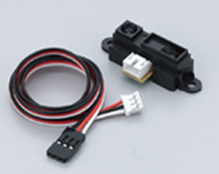
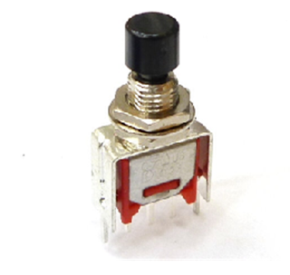

# ROBO-ONE Beginners 自律型ロボット(RasPi Pico)　Electronic Circuit
## <電子回路>
電子回路部分の完成写真です。

  

### Pico拡張ボード
入出力Pinが電源とともに出力されているのでとても便利です。

  

[購入先](https://www.amazon.co.jp/dp/B0B45YWJH7?ref=ppx_yo2ov_dt_b_fed_asin_title)

### Raspberry Pi Pico
PicoやPico w,pico2,pico2wなどを使用します。Pico2W、Pico2Wを使用すれば、Bluetoothによるコントロールプログラムが使用できます。

  

[購入先](https://akizukidenshi.com/catalog/g/g117947/)

### Serial変換I/F
サーボモーターを使用するためのシリアル通信の半二重通信から全二重通信に変換するボードです。

  

[購入先](https://www.besttechnology.co.jp/modules/onlineshop/index.php?fct=photo&p=299)

#### 配線方法
シリアル変換基板の配線状態です。

  

拡張基板に電源供給するためのコネクターをはんだ付けします。

  

[購入先](https://www.amazon.co.jp/hz/mobile/mission?p=dHkxoTufpjuQ0emaRyZ%2BIhguRa%2FwVxKAiiAWu7REqs%2FP8arZZaxN%2FAGHmiOIr3IzVqyp0oj4SP8kcADkDee1py1sYe5tW4Prcka9HdeznU8Z8oGUOPKSkxl2ULFpDS1KE5She5SjTgTHIWy0y98NuxpgbB2RO%2FIk4G1iOlfHG%2Bnd59c8O4%2BCfb8YcVZOtsbkJ8U4AaF8hzYoLLVjArd8zjwa3rssqte2mHQRjEp74U3M3zccfEuujPcM1yZJ8Ol3Q8if%2FYpn8kZJPm4irUFbDq27JzcmRKO82e0WOkJMcTXLeEzVWvXrXY03eKXQR%2BPZCBr3%2BcY%2B51ROoaw3Lf9%2BhIVkaHw%2FA%2FXQo0KAQ6gxaPHdLPl4i%2Bxu2y%2FmW%2BgkjyNZSJj5ql6RZ%2F%2FLYn5jNJ2e%2BNiGhoYqwVhLuKSJ8G6aXE6HTofxUyNHhC%2FPXk8qDU%2BW&ref_=ci_mcx_mi&pf_rd_r=DHZBHAC3DWB0YGXM36ZY&pf_rd_p=81736856-b9b1-48f5-95c5-06815082a022&pd_rd_r=62f20657-eaa7-4c87-814b-b5925f955cf6&pd_rd_w=zmL3C&pd_rd_wg=g1zeb)

シリアル変換基板のはんだ付けした状態です。

  
  
 
シリアルポート1に接続します。

  


### PSDセンサー
距離を計測するPSDセンサーです。出力はアナログ電圧ですのでADC端子に接続します。

  

[購入先](https://kondo-robot.com/product/02002)
```
右　 GP26
左   GP27
後ろ GP28
に接続します。
```
### TOFセンサー
距離を測定するTOFセンサーです。比較的長距離の距離の計測に使用します。

  

[購入先](https://www.amazon.co.jp/dp/B087N2JRJ9/ref=sspa_dk_detail_0?psc=1&pd_rd_i=B087N2JRJ9&pd_rd_w=S1om1&content-id=amzn1.sym.f293be60-50b7-49bc-95e8-931faf86ed1e&pf_rd_p=f293be60-50b7-49bc-95e8-931faf86ed1e&pf_rd_r=T8AB1F18CDD292K4XRB3&pd_rd_wg=BPNWh&pd_rd_r=b4a0289b-4286-4983-8f2f-0c5dc9c905ef&sp_csd=d2lkZ2V0TmFtZT1zcF9kZXRhaWw)
```
I2C1に接続します。
GP15    scl
GP14    sda
3V3     Vcc
GND     gnd
```

### IMU　9軸センサー
オイラー角の計測するためのセンサーです。I2C通信で使用します。

  

[購入先](https://www.amazon.co.jp/BNO055-%E7%B5%B6%E5%AF%BE%E6%96%B9%E5%90%91%E3%82%BB%E3%83%B3%E3%82%B5%E3%83%BC-%E3%83%9C%E3%83%BC%E3%83%89%E8%A7%92%E5%BA%A6-%E3%82%B8%E3%83%A3%E3%82%A4%E3%83%AD%E3%82%B9%E3%82%B3%E3%83%BC%E3%83%97-%E3%82%BB%E3%83%B3%E3%82%B5%E3%83%BC%E3%83%A2%E3%82%B8%E3%83%A5%E3%83%BC%E3%83%AB/dp/B0DWMH2Q5R/ref=sr_1_3_sspa?__mk_ja_JP=%E3%82%AB%E3%82%BF%E3%82%AB%E3%83%8A&crid=1KRTL7M5EYEPF&dib=eyJ2IjoiMSJ9.7aJLRn6PFVtPx5BZzxavXWUdBq4QwEbMpnBcoDqnpMJmxHoVhYJ4gzQt6b_R9lhVuWffEwHppjduuULQRPCgax7qg5t5qgFQfHdc8DSfOuYBcyJi1Tv2cfpOwKojhLSk9xG_D2LIu75vhbSQgj49-fiQHrr2MgcUOlqcltPMqVsFAmkuQuwnJx7NgNiZH12yXYVYVfVzXwOzbCQOS0TwsJiqzJAj3fesd1y6poiZst4qXJ1A6YwIt4y0FtPf-0LaM-zUtKZkWWMeuuI35nSUb_oIfNsG15sHmvkodnjwpNY.NwwWaNmR0Ko6-cTkWFGggAtHZlMR-3M_aj71AKZnqQk&dib_tag=se&keywords=bno055+%E3%82%BB%E3%83%B3%E3%82%B5%E3%83%BC&qid=1746504506&sprefix=bno055+%E3%82%BB%E3%83%B3%E3%82%B5%E3%83%BC%2Caps%2C178&sr=8-3-spons&sp_csd=d2lkZ2V0TmFtZT1zcF9hdGY&psc=1)
```
I2C0に接続します。
GP21    scl
GP20    sda
3V3      Vcc
GND    gnd
```
  

### Push ボタンSW
押しボタンスイッチです。入力として使います。

  
 
[購入先](https://akizukidenshi.com/catalog/g/g104367/)


1KΩ程度の抵抗を追加し、GP16に接続します。外側から締め付けるタイプを使用すると組み立てる前にはんだをしておくことが出来ます。

### LED
発光ダイオードです。1KΩ程度の抵抗を追加して使用します。リードの長い方が一般にアノードです。プラス側に接続します。

  

[購入先](https://akizukidenshi.com/catalog/g/g103261/)

  

GP17に接続する。GNDは接続しません。

### 電源SWハーネス
電源用のスイッチです。

  
 
[購入先](https://kondo-robot.com/product/lv_sw_harness)

### ニッケル水素バッテリー
このサイズのニッケル水素バッテリーのみが使用可能です。

  

[購入先](https://kondo-robot.com/product/02335)

### ROBOパワーセル用コネクターセットオス
拡張基板への電源供給用に使用します。

  
 
[購入先](https://kondo-robot.com/product/01109)

### 電源ケーブルA
拡張基板への電源供給用に使用します。

  

[購入先](https://kondo-robot.com/product/02145)


