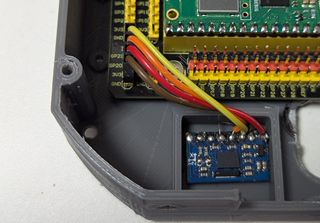

# ROBO-ONE Beginners 自律型ロボット(RasPi Pico)　Electronic Circuit
## コンセプト
自律型でビジョンを除く必要なセンサーを搭載しました。はんだ付けは極力少なくするようにしました。入出力の拡張も余裕を持たせました。以下は電子回路部分の完成写真です。

  

### Pico拡張ボード
入出力Pinが電源とともに出力されているのでとても便利です。黒:gnd 赤:3.3v 黄:信号

  

[拡張ボードの購入先例](https://www.amazon.co.jp/dp/B0B45YWJH7?ref=ppx_yo2ov_dt_b_fed_asin_title)

### Raspberry Pi Pico
PicoやPico w,pico2,pico2wなどを使用します。PicoW、Pico2Wを使用すれば、Bluetoothによるコントロールプログラムが利用できます。

[Pico-series 仕様](https://www.raspberrypi.com/documentation/microcontrollers/pico-series.html#pico-2-family)

[Picoの購入先例](https://akizukidenshi.com/catalog/g/g117947/)

### Serial変換I/F
サーボモーターを使用するためのシリアル通信を全二重通信から半二重通信に変換するボードです。

[Serial変換I/Fの購入先](https://www.besttechnology.co.jp/modules/onlineshop/index.php?fct=photo&p=299)

#### 配線方法
シリアル変換I/Fの配線状態です。(シリアル変換I/Fボードは仕様変更がありますので配線に当たっては必ずマニアルでご確認ください。)


(2025年8月22日追加変更)
この配線では回路ではシリアル変換I/Fボードに配線が集中するので分配器を追加しました。


[分配器の購入先](https://www.besttechnology.co.jp/modules/onlineshop/index.php?fct=photo&p=317)

コネクターをはんだ付けしていないキットを購入すればコネクターの変更によって以下のように近藤科学のサーボや電源コネクターに対応することができます。
  
  

拡張基板に電源供給するためのコネクターをはんだ付けしておきます。コネクターはラジコン用に使われているもので、分配器に接続します。

  

これらを接続すると以下のようになります。
  

シリアル変換I/Fボードは拡張基板のシリアルポート1に接続します。
全てのコネクターは方向を間違えないように挿してください。破損の原因となります。

コネクターの作り方については以下のサイトなどをご参照ください。
[コネクターの作り方](https://flyingcattokyo.sakura.ne.jp/MN-016/aa_mn-016.htm)

### PSDセンサー(SHARP製 GP2Y0A21YK0F)
PSD（Position Sensitive Detector）は光が当たった位置に応じて、アナログ信号を出力する受光素子で、距離を計測するセンサーです。出力はアナログ電圧ですのでADC端子に接続します。黒:gnd　赤:3.3v  黄:信号で、ケーブルは黒:gnd　赤:3.3v  白:信号に対応します。このセンサーの推奨電圧は5Vですが3.3Vでも問題なく動作しています。

  

[購入先](https://kondo-robot.com/product/02002)
```
右　 GP26
左   GP27
後ろ GP28
に接続します。接続方向を間違えないようにしてください。
```
### ToFセンサー(TF-Luna)
光を発射し、それが反射して戻ってくるまでの時間を計測することで、距離を測定するToF(Time of Flight)センサーです。比較的長距離の距離の計測に使用します。このセンサーでは3m程度まで測定できます。


推奨電圧は5Vですが、3.3Vでも動作を確認しました。

  

動作が不安定な場合は拡張ボードから5V電圧が出ていますのでこちらから給電してください。

[購入先](https://www.amazon.co.jp/dp/B087N2JRJ9/ref=sspa_dk_detail_0?psc=1&pd_rd_i=B087N2JRJ9&pd_rd_w=S1om1&content-id=amzn1.sym.f293be60-50b7-49bc-95e8-931faf86ed1e&pf_rd_p=f293be60-50b7-49bc-95e8-931faf86ed1e&pf_rd_r=T8AB1F18CDD292K4XRB3&pd_rd_wg=BPNWh&pd_rd_r=b4a0289b-4286-4983-8f2f-0c5dc9c905ef&sp_csd=d2lkZ2V0TmFtZT1zcF9kZXRhaWw)
```
I2C1に接続します。
GP15    scl
GP14    sda
3V3     Vcc
GND     gnd
```

### IMU　9軸センサー(BNO055)
IMU(Inertial Measurement Unit)は、慣性計測装置のことで、3次元の慣性運動（並進運動と回転運動）を検出するために、加速度センサーと角速度（ジャイロ）センサーを組み合わせた装置です。ここではロボットの姿勢(オイラー角)を計測するために使用します。I2C通信で使用します。基板面に垂直方向がヨー軸で基板の長い面に平行な方向がロール軸、短い面に平行な軸がピッチ軸となります。


BNO055ブレークアウトボードにはいろいろあるようなので使用に当たっては注意が必要です。
うまく動作しない場合は以下のサイトをご参照ください。

[モーションセンサBNO055が動かない,I2C接続で認識されないとき](https://trhk.exblog.jp/30642762)

[購入先](https://www.amazon.co.jp/BNO055-%E7%B5%B6%E5%AF%BE%E6%96%B9%E5%90%91%E3%82%BB%E3%83%B3%E3%82%B5%E3%83%BC-%E3%83%9C%E3%83%BC%E3%83%89%E8%A7%92%E5%BA%A6-%E3%82%B8%E3%83%A3%E3%82%A4%E3%83%AD%E3%82%B9%E3%82%B3%E3%83%BC%E3%83%97-%E3%82%BB%E3%83%B3%E3%82%B5%E3%83%BC%E3%83%A2%E3%82%B8%E3%83%A5%E3%83%BC%E3%83%AB/dp/B0DWMH2Q5R/ref=sr_1_3_sspa?__mk_ja_JP=%E3%82%AB%E3%82%BF%E3%82%AB%E3%83%8A&crid=1KRTL7M5EYEPF&dib=eyJ2IjoiMSJ9.7aJLRn6PFVtPx5BZzxavXWUdBq4QwEbMpnBcoDqnpMJmxHoVhYJ4gzQt6b_R9lhVuWffEwHppjduuULQRPCgax7qg5t5qgFQfHdc8DSfOuYBcyJi1Tv2cfpOwKojhLSk9xG_D2LIu75vhbSQgj49-fiQHrr2MgcUOlqcltPMqVsFAmkuQuwnJx7NgNiZH12yXYVYVfVzXwOzbCQOS0TwsJiqzJAj3fesd1y6poiZst4qXJ1A6YwIt4y0FtPf-0LaM-zUtKZkWWMeuuI35nSUb_oIfNsG15sHmvkodnjwpNY.NwwWaNmR0Ko6-cTkWFGggAtHZlMR-3M_aj71AKZnqQk&dib_tag=se&keywords=bno055+%E3%82%BB%E3%83%B3%E3%82%B5%E3%83%BC&qid=1746504506&sprefix=bno055+%E3%82%BB%E3%83%B3%E3%82%B5%E3%83%BC%2Caps%2C178&sr=8-3-spons&sp_csd=d2lkZ2V0TmFtZT1zcF9hdGY&psc=1)
```
I2C0に接続します。
GP21    scl
GP20    sda
3V3      Vcc
GND    gnd
```
  

以下のボードも確認しました。同じプログラムで動作します。

 

[WCMCU055の購入先](https://www.amazon.co.jp/inscriptions-BNO055-%E3%82%A4%E3%83%B3%E3%83%86%E3%83%AA%E3%82%B8%E3%82%A7%E3%83%B3%E3%83%88-%E5%A7%BF%E5%8B%A2%E3%82%BB%E3%83%B3%E3%82%B5%E3%83%BC-MCU-055/dp/B0D5TFDLPZ/ref=sr_1_3_sspa?__mk_ja_JP=%E3%82%AB%E3%82%BF%E3%82%AB%E3%83%8A&crid=19SHAU4M5UI09&keywords=WCMCU055&qid=1748325642&sprefix=wcmcu055%2Caps%2C168&sr=8-3-spons&sp_csd=d2lkZ2V0TmFtZT1zcF9tdGY&psc=1)

使い方は[こちら](https://www.davidpilling.com/wiki/index.php/BNO055)をご参照ください。

秋月電子のBNO055使用9軸センサフュージョンモジュールもテストして見ました。

[秋月電子BNO055の購入先](https://akizukidenshi.com/catalog/g/g116996/)

ボード上でプルアップされていないので、SDA,SCL端子を2kΩ程度の抵抗でプルアップしてください。同じプログラムで動作します。


### Push ボタンSW
押しボタンスイッチです。入力として使います。1KΩ程度の抵抗を追加し、GP17に接続します。

  
  
 
[購入先](https://akizukidenshi.com/catalog/g/g104367/)


### LED
発光ダイオードです。1KΩ程度の抵抗を追加して使用します。リードの長い方が一般にアノードです。プラス側に接続します。ここではGP16に接続します。GNDは接続しません。

  
  

[購入先](https://akizukidenshi.com/catalog/g/g104764/)

### 電源SWハーネス
電源用のスイッチです。

  
 
[購入先](https://kondo-robot.com/product/lv_sw_harness)

### ニッケル水素バッテリー
このサイズのニッケル水素バッテリーのみが使用可能です。

  

[購入先](https://kondo-robot.com/product/02335)

### ROBOパワーセル用コネクターセットオス
拡張基板への電源供給用に使用できます。

  
 
[購入先](https://kondo-robot.com/product/01109)

### 電源ケーブルA
拡張基板への電源供給用に使用できます。

  

[購入先](https://kondo-robot.com/product/02145)


