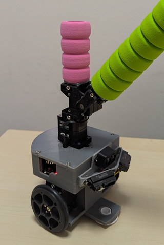
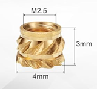
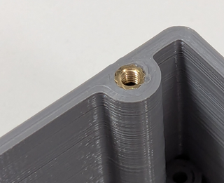
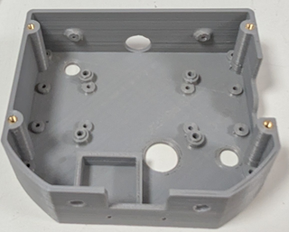
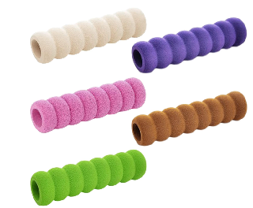

# ROBO-ONE Beginners 自律型ロボット Mechanical Design (機械設計)
## コンセプト
このロボットはRaspberry Pi Picoを使った初心者向けの自律型ロボットです。
構造は操縦型ロボットと同じプロポーションとし、できるだけ共通化します。また発展性を考え、倒立伸子の実験にも対応します。

 

### 全体図
操縦型ロボットとできるだけ共通化、倒立伸子の実験も可能な構造としました。

 
 
 

### 足回りパーツ(操縦型と共通)
キャスター部を取り外すと倒立伸子としての使用が可能となります。駆動は近藤科学のKRS3301を使用します。バッテリーにはニッケル水素電池のみの使用とします。
組み立ての相手はKXRパーツのジョイントベースAです。2mmのビスと2.6mmのビスを使用してください。
 

 
   

### Pico CPU case
センサーを多く付けたためPicoのケースが大きくなりました。
拡張ボードの締め付けにはM3-8皿ホーン止めビスを使用ます。

   
   
  
CPUカバーの締め付けを繰り返すとねじが馬鹿になるのでインサートを使用しました。

   

[購入先](https://www.amazon.co.jp/dp/B0DCV9GJND?ref=ppx_yo2ov_dt_b_fed_asin_title)

   
   

### PSDと ToF　センサーブラケット

Psd2個とToFセンサーのブラケットです。Cpu-caseには2mmタッピングビスで締め付けます。センサーも2mmタッピングビスで締め付けますがワッシャーを使ってください。Psd2センサーは左右へ22°、下へ20°傾いて取り付けられます。ToFセンサーは正面下へ10°傾いて取り付けられます。

   

後部センサーブラケットです。Cpu-caseには2mmタッピングビスで締め付けます。センサーも2mmタッピングビスで締め付けますがワッシャーを使ってください。センサーは下へ20°傾いて取り付けられます。

  

### Head と Arm
この2点は操縦型と共通です。 組み立ての相手はKXRパーツのジョイントベースAです。2mmのビスを使用して取り付けてください。

  
  

Head部とArm部には安全や器物保護のためスポンジのドアノブカバーを使用します。
ピンクと紫は半分に切ってHead部に使用します。赤コーナーの場合はピンク、青コーナーは紫です。その他の色はArmに使ってください。Head部は交換しやすくするために締め代を少なくしています。

  

[購入先](https://amzn.asia/d/89CXsD9) 

