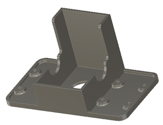
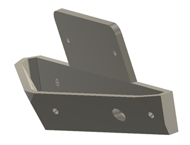

# ROBO-ONE Beginners 自律型ロボット Mechanical Design (機械設計)
## コンセプト
このロボットはRaspberry Pi Picoを使った初心者向けの自律型ロボットです。
構造は操縦型ロボットと同じプロポーションとし、できるだけ共通化します。また発展性を考え、倒立伸子の実験にも対応します。

 

### 全体図
操縦型ロボットとできるだけ共通化、倒立伸子の実験も可能な構造としました。

 
 
 

### 足回りパーツ
キャスター部を取り外すと倒立伸子としての使用が可能となります。駆動は近藤科学のKRS3301を使用します。バッテリーにはニッケル水素電池のみの使用とします。

 
 
   

### Pico CPU case
センサーを多く付けたためPicoのケースが大きくなりました。

   
   
  
CPUカバーの締め付けを繰り返すとねじが馬鹿になるのでインサートを使用しました。

   
   
   

### PSDと ToF　センサーブラケット

   　　 
  

### Head と Arm
この2点は操縦型と共通です。

  
  

HeadとArmには安全や器物保護のためスポンジのドアノブカバーを使用します。

  

[購入先](https://amzn.asia/d/89CXsD9) 

