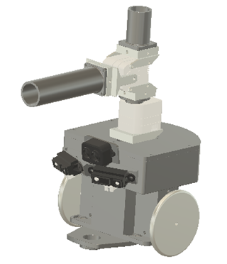
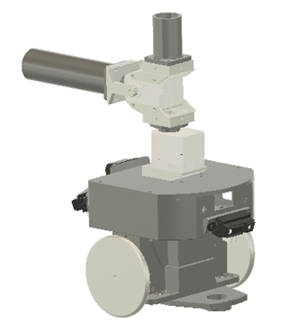
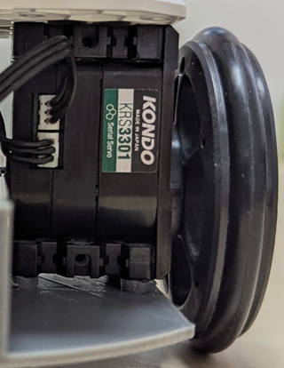
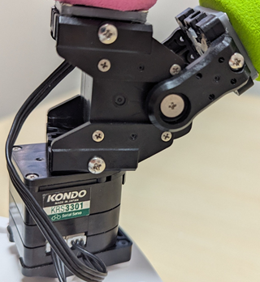
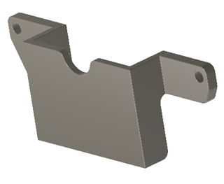
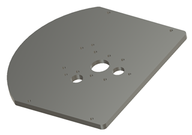
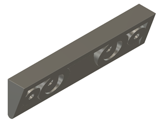
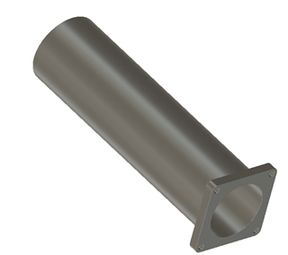

# ROBO-ONE Beginners 自律型ロボット Mechanical Design (機械設計)
## コンセプト
このロボットはRaspberry Pi Picoを使った初心者向けの自律型ロボットです。
__構造は操縦型ロボットと同じプロポーションとし、できるだけ共通化します。__ また発展性を考え、倒立伸子の実験にも対応します。

 

### 全体図
操縦型ロボットとできるだけ部品を共通化、倒立伸子の実験も可能な構造としました。

 
 
 

### 足回りパーツ(操縦型と共通)
キャスター部を取り外すと倒立伸子としての使用が可能となります。駆動は近藤科学のKRS3301を使用します。バッテリーにはニッケル水素電池のみの使用とします。
組み立ての相手はKXRパーツのジョイントベースAです。M2-8mmのビスとM2.6-10mmのビスを使用してください。
(詳細の説明の無いビスは近藤科学のものを使用しています。また __PLAに直接ねじを締め付ける場合はタッピングビスを使用します。ただし締め外しの頻度の高い部分はインサートを使用します。__ )

KXRパーツを使ったドライブセットとアームセットを使用します。

[KXRパーツ](https://kondo-robot.com/product-category/parts/kxrparts)

 
 

[ジョイントベースA](https://kondo-robot.com/product/02300)

[アームサポーター3300A](https://kondo-robot.com/product/02306)

足回りパーツ

 
 
   

### Pico CPU case
センサーを多く付けたためPicoのケースが大きくなりました。
拡張ボードの締め付けにはM2.6-8mmタッピングビスを使用ます。

   
   
  
CPUカバーの締め付けを繰り返すとねじが馬鹿になるのでインサートを使用しました。購入の都合でM2.5を使用していますので、M2.5のねじ(近藤科学のM2.6も使用できますが締め付けが少し硬い)を使用するかインサートをM3にしても良いでしょう。

   

[動画](https://www.youtube.com/shorts/zL2C9oKePpQ)

[購入先](https://www.amazon.co.jp/dp/B0DCV9GJND?ref=ppx_yo2ov_dt_b_fed_asin_title)

   
   

### PSDと ToF　センサーブラケット

PSD 2個とToFセンサーのブラケットです。Cpu-caseには2mmタッピングビスで締め付けます。センサーは2mm皿タッピングビスで締め付けます。PSD 2個のセンサーは左右へ22°、下へ20°傾いて取り付けられます。ToFセンサーは正面下へ10°傾いて取り付けられます。

   

後部センサーブラケットです。Cpu-caseには2mmタッピングビスで締め付けます。センサーも2mm皿タッピングビスで締め付けます。センサーは下へ20°傾いて取り付けられます。
PSDについてはリングエッジの認識、相手の認識を目的としています。また後ろの相手も認識します。ToFセンサーに関しては少し長い距離を測定します。相手の認識やリングエッジを認識します。IMUと組み合わせることで自己位置の推定も可能となります。

  

### Head と Arm
この2点は操縦型と共通です。 組み立ての相手はKXRパーツのジョイントベースAです。2mmのビスを使用して取り付けてください。

  
  

Head部とArm部には安全や器物保護のためスポンジのドアノブカバーを使用します。
ピンクと紫は半分に切ってHead部に使用します。赤コーナーの場合はピンク、青コーナーは紫です。その他の色はArmに使ってください。Head部は交換しやすくするために締め代を少なくしています。

  

[購入先](https://amzn.asia/d/89CXsD9) 

