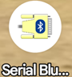
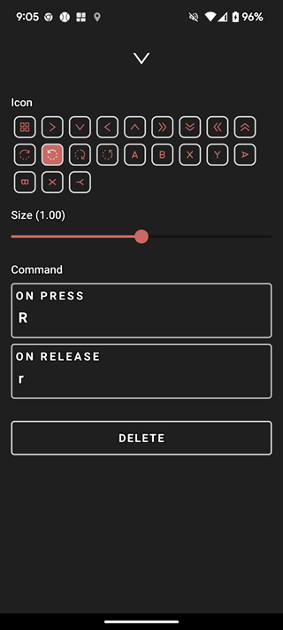
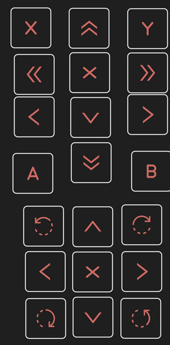
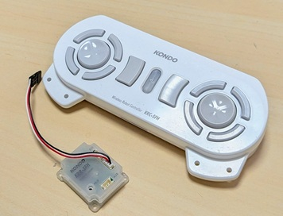

# ROBO-ONE Beginners 自律型ロボット Software
このロボットはRaspberry Pi Picoを使った初心者向けの自律型ロボットです。MycroPythonを使用してプログラミングします。

## 開発環境
- PCのOS
  Windows
- 統合開発環境
  Thonny
- 開発言語
  Micro Python

### Thonnyのインストール

[Thonnyのインストール【Windows編】](https://sanuki-tech.net/and-more/2022/install-thonny-python-ide/)

### Raspberry Pi Pico

[Pico-series Microcontrollers](https://www.raspberrypi.com/documentation/microcontrollers/pico-series.html#pico-2-family)

### picoの開発の流れ

- リセントボタンを押しながら電源をいれる。
- PCにPICOのフォルダーを認識
- UF2フィルをダウンロードし書き込み
- Thonnyを起動
- ツールオプションの設定
- サンプルプログラムをロード/実行
- main.pyとしてpicoに保存(自動起動)

### UF2ファイル
UF2は-USB Flashing Format(UF2)-Microsoftが開発したマイコン書き込み用のファイルフォーマットです。以下のサイトより適切なuf2ファイルをダウン―ドしてください。

[Download the correct MicroPython UF2 file for your board](https://www.raspberrypi.com/documentation/microcontrollers/micropython.html)

### Picoの起動

UF2ファイルをダウンロードし、picoのフォルダーにコピペしてください。電源を入れるとPicoが起動します。
Thonnyにて以下を設定します。

- ConfigでインタープリターをMicroPython(Raspberry Pi Pico)に設定します。ポートが表示されていることを確認します。
- MicroPython(Raspberry Pi Pico)のポートに接続します。
- Shell画面が以下の要になれば設定完了です。
- すでにプログラムが書き込まれているときはThonnyのストップボタンをおすか、Pico拡張ボード上のリセットボタンを押した後、ポートに再接続します。
```
MicroPython v1.25.0 on 2025-04-15; Raspberry Pi Pico W with RP2040
Type "help()" for more information.
>>> 
```
## サンプルプログラム
### 押しボタンSW入力とLed点滅
example/io/switch_led_test.pyはスイッチ入力によりLEDを点灯するプログラムです。

### ADCとPSD入力
example/psd/psd_test.pyはPSDセンサーの出力電圧をADコンバーターにより取り込みその電圧を距離に変換するプログラムです。

### Serial Servoのコントロール
example/krs/krs_driver.pyは近藤科学のKRSサーボモーターをコントロールするためのプログラムです。

[KRS-3301 ICS](https://kondo-robot.com/product/krs-3301-ics)

[ICS3.5/3.6 ソフトウェアマニュアルコマンドリファレンス](chrome-extension://efaidnbmnnnibpcajpcglclefindmkaj/https://kondo-robot.com/w/wp-content/uploads/ICS3.5_3.6_SoftwareManual_2_9.pdf)

ソフトウェアマニュアルコマンドリファレンスを参考に必要な機能のみプログラムしました。
サーボのボーレイトはは1250000bpsに設定されているものとして以下のように初期化しています。
```
class KRSdriver():
  def __init__(self):
   #set serial
    self.con = UART(1, baudrate=1250000, tx=Pin(8), rx=Pin(9))
    self.con.init(bits=8, parity=0, stop=1,timeout=50)
```
mainプログラムで各軸のポジションの取得やモーターの回転方向などのテストができます。
```
if __name__ == '__main__':
  print('Start KRS Test')
  krs=KRSdriver()
#
  get_position_all()　# すべての軸のポジションを取得
  arm_set() # アームのセットポジションへ移動
  drive_set() # モーターを直進後転回
```
またサーボモーターの設定は以下のようにしています。


### I2cスキャナー
example/i2c/i2c_2ch_scaner.pyはI2Cに接続されているデバイスのアドレスを以下のように表示します。
```
>>> %Run -c $EDITOR_CONTENT
MPY: soft reboot
I2C0-I2C1 SCANNER
i2c0 devices found: 1
I2C0  address:  0x28
i2c1 devices found: 1
I2C1  address:  0x10
>>> 
```

[参考 Raspberry Pi Pico: I2C Scanner (MicroPython) – Finding the Address of I2C Devices](https://randomnerdtutorials.com/raspberry-pi-pico-i2c-scanner-micropython/)

### IMU BNO055-driver
以下はbno055のmicropython driverです。
```
example/imu/bno055_test.py
example/imu/bno055_base.py
example/imu/bno055.py
```
このプログラムは以下のサイトのものを使わせて頂きました。[Adafruit 9-DOF Absolute Orientation IMU Fusion Breakout - BNO055](https://www.adafruit.com/product/2472)がベースとなっているとのことでこちらのボードを使うとより良いでしょう。

[参照 micropython-bno055](https://github.com/micropython-IMU/micropython-bno055)

BNO055のaddressは28または29となります。このプログラムでは下記の二か所のアドレスを変更する必要があります。
```
bno055_base.py の81行目
  def __init__(self, i2c, address=0x28, 
```
および
```
bno055.pyの118行目
　def __init__(self, i2c, address=0x28, crystal=True, 
```
の二か所です。i2c_scanner.pyでご確認の上変更してください。

#### cariblationの方法
キャリブレーションの方法は[BNO055メモ](https://qiita.com/yomori/items/95101a8792287263792b)によると
```
- 加速度計のキャリブレーション
デバイスを数秒間、6つの異なる安定した位置に置く。位置の変更はゆっくりと動かすようにする。6つの安定した位置は任意の方向でよいが、装置が少なくとも1回はX,Y,Z軸に垂直になるようにする。
- ジャイロスコープのキャリブレーション
デバイスを数秒間、単一の安定した位置に置く。
- 磁力計のキャリブレーション
磁力計はHard-iron歪みとSoft-iron歪みの両方の影響を受けるが、多くの場合、Hard-ironの影響が原因。
装置全体をランダムな動き（たとえば、空中に数字の「8」を書くなど）をいくつか行うことでHard-ironに対するキャリブレーションを行う。
- CALIB_STATレジスタで、加速度計のキャリブレーション状態を確認できる。すべてが3になると終了する。
```
だそうです。  試合中にはキャリブレーションはできないので、事前にやっておく必要があります。またはキャリブレーションを行わずにセット位置を基準に動作させるのが良いでしょう。

example/imu/bno055_test.pyを実行することでキャリブレーションの有無を確認できます。calibrated = Falseで実行するとキャリブレーションを開始します。出力は絶対位置となります。
calibrated = Trueではキャリブレーションはせずに出力は相対位置となります。起動時の姿勢をヨー角0°とします。

### ToF センサー TF-Lunaライブラリー
以下は[TF-Luna LiDAR Range Sensor](https://www.waveshare.com/wiki/TF-Luna_LiDAR_Range_Sensor)を使用するためのライブラリーです。
```
example/tof/tof_test.py
example/tof/tof_max_mini.py
example/tof/lider.py
```
以下のサイトのライブラリーを使わせて頂きました。
[参照 tf-luna-micropython](https://github.com/davmoz/tf-luna-micropython)

[参考サイト class I2C – a two-wire serial protocol](https://docs.micropython.org/en/latest/library/machine.I2C.html)

### BLE 通信ライブラリー
以下はBLEの通信ライブラリーです。
```
example/ble/ble_test.py
example/ble/ble_simple_peripheral.py
example/ble/ble_advertising.py
```
以下のサイトから通信ライブラリーを使わせて頂きました。
[参照 Pi Pico W でBluetooth Low Energy（BLE）を試してみる](https://wisteriahill.sakura.ne.jp/CMS/WordPress/2023/10/09/pi-pico-bluetooth-low-energy-ble/)

example/ble/ble_test.pyを実行して、接続確認をしましょう。
example/ble/ble_simple_peripheral.pyの36行目のnameを変更しておくとbluetoothをscanしたときにこの名前が現れます。
スマホのアプリからSerial Bluetooth Terminal(以下のアイコン)をダウンロードしてこれに接続します。このterminalから入力したテキストがシェルに表示されれば接続テスト完了です。



### BLEを使ったスマホによるロボットコントロール
- [スマホによる操縦プログラム](https://www.youtube.com/shorts/bfC331REHko)
- [PSDによるリングエッジの認識と回避](https://www.youtube.com/shorts/sOUL5hm2Ak4)
- [PSDによる相手の認識と攻撃](https://www.youtube.com/shorts/i9BcCGD1VBw)

example/beginners/robo_beginners.pyはスマホによるロボットコントロールプログラムです。
スマホのアプリBaconを使用します。アプリからダウンロードしてください。以下のアイコンです。


コントロール画面は以下のように押したときにコマンドを発行し、離した時に発行されるコマンドを設定します。
動画の様な画面を自由に作ってください。



### PSDとToFセンサーを使用したサンプルプログラム
ToFセンサーを追加し相手を探す簡単なサンプルプログラムを追加しました。
```
example/beginners/robo_beginners_tof.py
```
Tofセンサーは1m程度先を見るように設定しリング外のものに反応しないように、また外乱光の影響を受け難いようにします。
相手がいるときはまっすぐ進みます。近づけば、PSDセンサーが反応し相手を打突します。相手がいない時はくねくねとターンを繰り返しながら相手を探します。

- [ToFセンサーで相手を探す](https://youtu.be/fS7ZChnerrg)

Baconは写真のように上段をアームに、下段を足回りにそれぞれ矢印の方向に動作するように設定しました。またAボタンでauto、Bボタンで操縦型などと自由に設定してください。



### 近藤科学のコントローラーKRS-5FHを使う。

1). 接続と基本設定

KRS-5FH（送信機・受信機セット）を使用するには、まず物理的な接続と設定が必要です。



接続方法: 受信機をサーボモータと同じように**デイジーチェーン（数珠つなぎ）**で接続します。

通信設定:
- ID: 31（固定）
- ボーレート: 接続しているサーボモータの設定に合わせてください。

2). ドライバーの更新内容（krs_driver_v2_0.py）
```
example/krs/krs_driver_v2_0.py
```
新しいドライバーでは、以下の2つの機能が追加されています。

- KRS-5FHのデータ取得: 送信機からのボタン入力を読み取ります。
- 不揮発性メモリへのアクセス: サーボ（KRS）の内部パラメータを直接書き換えられるようになりました。

3). KRS-5FHからデータを取得する方法
ドライバー内の get_5fh() ルーチンを呼び出すと、ボタンの押下状態が 16bit（2バイト） のデータとして返ってきます。
- 仕組み: 各ボタンが16bitの各ビットに対応しており、ボタンを押すとそのビットが 1（ON）になります。
- サンプルコード:以下のコードを走らせ、送信機のボタンを押すと、対応する数値がコンソールに表示されます。

Python
```
from krs_driver_v2_0 import *
import time
# ドライバーの初期化
krs = KRSdriver()
while True:
    # 送信機のボタンデータを取得（2バイト分）
    a, b = krs.get_5fh()
    print(f"Byte A: {a}, Byte B: {b}")
    # 0.002秒待機
    time.sleep(0.002)
```
4). 活用のアドバイス
取得した数値（a, b）をプログラム内で比較・判定することで、特定のボタンが押された時に「前へ移動する」「面を打つ」といったアクションを割り当て、ロボットを自由自在に操縦できるようになります。
