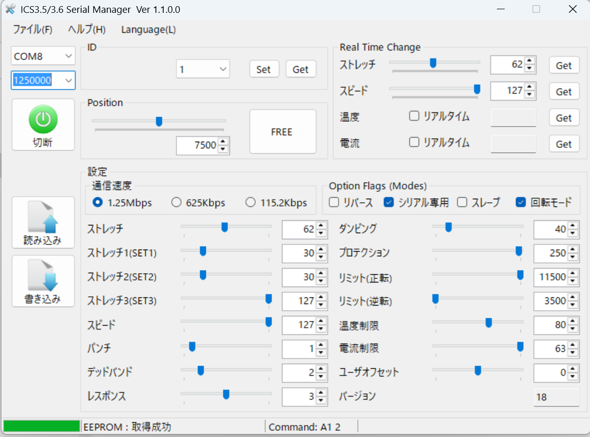

# ROBO-ONE Beginners 自律型ロボット Software
# ソフトウェア
このロボットはRaspberry Pi Picoを使った初心者向けの自律型ロボットです。MycroPythonを使用してプログラミングします。
プログラムに関しては下記概ね確認済みです。少しずつ公開していきます。

## 開発環境
### PCのOS
Windows
### 統合開発環境
Thonny
### 開発言語
Micro Python
### Thonnyのインストール
　Config等

Picoの設定

Micro Pythonの初期設定

## サーボモーターの設定

設定の画面コピー

## サンプルプログラム
-押しボタン入力とLed点滅

-ADCとPSD入力

-Serial Servoのコントロール

-PSDによるリングエッジの認識と回避

-PSDによる相手の認識と攻撃

-IMUライブラリー

-ToFライブラリー

-ToFとIMUによる相手認識

-倒立伸子の制御

-BLE 通信ライブラリー

-BLEを使ったスマホによるロボットコントロール
