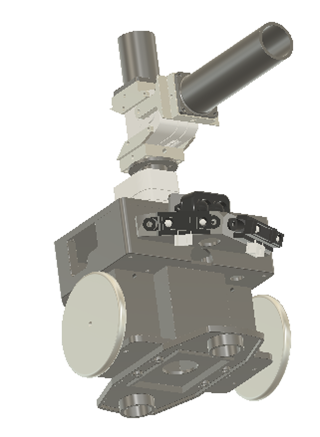
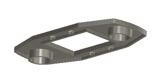
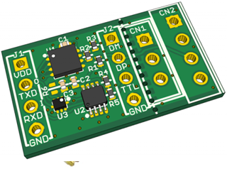
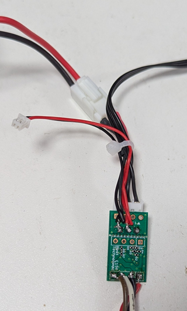

# ROBO-ONE Beginners 自型律Pico用ロボット

20250506 ARRC_西村

このロボットはRaspberry Pi Picoを使った初心者向けの自律型ロボットです。操縦型ロボットとできるだけ共通化するとともに、倒立伸子の実験も可能とした構造とします。

## <メカ>
### 全体図
操縦型ロボットとできるだけ共通化、倒立伸子の実験も可能な構造としました。

 
 
 

### 足回りパーツ
キャスター部を取り外すと倒立伸子としての使用が可能となります。駆動は近藤科学のKRS3301を使用します。バッテリーにはニッケル水素電池のみの使用とします。

 
 
   

### Pico CPU case
センサーを多く付けたためPicoのケースが大きくなりました。

   
   
  
CPUカバーの締め付けを繰り返すとねじが馬鹿になるのでインサートを使用しました。

### PSDdと ToF　センサーブラケット

   　　 
  

### Head と Arm
この2点は操縦型と共通です。

  
  

## <ハード>

### Pico拡張ボード
入出力Pinが電源とともに出力されているのでとても便利です。

  

[購入先](https://www.amazon.co.jp/dp/B0B45YWJH7?ref=ppx_yo2ov_dt_b_fed_asin_title)

### Raspberry Pi Pico
PicoやPico w,pico2,pico2wなどを使用します。Pico2W、Pico2Wを使用すれば、Bluetoothによるコントロールプログラムが使用できます。
  

[購入先](https://akizukidenshi.com/catalog/g/g117947/)

### Serial変換I/F
サーボモーターを使用するためのシリアル通信の半二重通信から全二重通信に変換するボードです。

  

[購入先](https://www.besttechnology.co.jp/modules/onlineshop/index.php?fct=photo&p=299)

#### 配線方法
シリアル変換基板の配線状態です。

  

拡張基板に電源供給するためのコネクターをはんだ付けします。

  

シリアル変換基板のはんだ付けした状態です。

  
  
 
シリアルポート1に接続します。

  

### PSDセンサー
距離を計測するPSDセンサーです。出力はアナログ電圧ですのでADC端子に接続します。

  

[購入先](https://kondo-robot.com/product/02002)
```
右　 GP26
左   GP27
後ろ GP28
に接続します。
```
### TOFセンサー
距離を測定するTOFセンサーです。比較的長距離の距離の計測に使用します。

  

[購入先](https://www.amazon.co.jp/dp/B087N2JRJ9/ref=sspa_dk_detail_0?psc=1&pd_rd_i=B087N2JRJ9&pd_rd_w=S1om1&content-id=amzn1.sym.f293be60-50b7-49bc-95e8-931faf86ed1e&pf_rd_p=f293be60-50b7-49bc-95e8-931faf86ed1e&pf_rd_r=T8AB1F18CDD292K4XRB3&pd_rd_wg=BPNWh&pd_rd_r=b4a0289b-4286-4983-8f2f-0c5dc9c905ef&sp_csd=d2lkZ2V0TmFtZT1zcF9kZXRhaWw)
```
I2C1に接続します。
GP15    scl
GP14    sda
3V3     Vcc
GND     gnd
```

### IMU　9軸センサー
オイラー角の計測するためのセンサーです。I2C通信で使用します。

  

[購入先](https://www.amazon.co.jp/BNO055-%E7%B5%B6%E5%AF%BE%E6%96%B9%E5%90%91%E3%82%BB%E3%83%B3%E3%82%B5%E3%83%BC-%E3%83%9C%E3%83%BC%E3%83%89%E8%A7%92%E5%BA%A6-%E3%82%B8%E3%83%A3%E3%82%A4%E3%83%AD%E3%82%B9%E3%82%B3%E3%83%BC%E3%83%97-%E3%82%BB%E3%83%B3%E3%82%B5%E3%83%BC%E3%83%A2%E3%82%B8%E3%83%A5%E3%83%BC%E3%83%AB/dp/B0DWMH2Q5R/ref=sr_1_3_sspa?__mk_ja_JP=%E3%82%AB%E3%82%BF%E3%82%AB%E3%83%8A&crid=1KRTL7M5EYEPF&dib=eyJ2IjoiMSJ9.7aJLRn6PFVtPx5BZzxavXWUdBq4QwEbMpnBcoDqnpMJmxHoVhYJ4gzQt6b_R9lhVuWffEwHppjduuULQRPCgax7qg5t5qgFQfHdc8DSfOuYBcyJi1Tv2cfpOwKojhLSk9xG_D2LIu75vhbSQgj49-fiQHrr2MgcUOlqcltPMqVsFAmkuQuwnJx7NgNiZH12yXYVYVfVzXwOzbCQOS0TwsJiqzJAj3fesd1y6poiZst4qXJ1A6YwIt4y0FtPf-0LaM-zUtKZkWWMeuuI35nSUb_oIfNsG15sHmvkodnjwpNY.NwwWaNmR0Ko6-cTkWFGggAtHZlMR-3M_aj71AKZnqQk&dib_tag=se&keywords=bno055+%E3%82%BB%E3%83%B3%E3%82%B5%E3%83%BC&qid=1746504506&sprefix=bno055+%E3%82%BB%E3%83%B3%E3%82%B5%E3%83%BC%2Caps%2C178&sr=8-3-spons&sp_csd=d2lkZ2V0TmFtZT1zcF9hdGY&psc=1)
```
I2C0に接続します。
GP21    scl
GP20    sda
3V3      Vcc
GND    gnd
```
  

### Push ボタンSW
押しボタンスイッチです。入力として使います。

  
 
[購入先](https://akizukidenshi.com/catalog/g/g104367/)

 
1KΩ程度の抵抗を追加し、GP16に接続します。外側から締め付けるタイプを使用すると組み立てる前にはんだをしておくことが出来ます。

### LED
発光ダイオードです。1KΩ程度の抵抗を追加して使用します。リードの長い方が一般にアノードです。プラス側に接続します。

  

[購入先](https://akizukidenshi.com/catalog/g/g103261/)

 
GP17に接続する。GNDは接続しません。

### 電源SWハーネス
電源用のスイッチです。

  
 
[購入先](https://kondo-robot.com/product/lv_sw_harness)

### ニッケル水素バッテリー
このサイズのニッケル水素バッテリーのみが使用可能です。

  

[購入先](https://kondo-robot.com/product/02335)

### ROBOパワーセル用コネクターセットオス
拡張基板への電源供給用に使用します。

  
 
[購入先](https://kondo-robot.com/product/01109)

### 電源ケーブルA
拡張基板への電源供給用に使用します。

  

[購入先](https://kondo-robot.com/product/02145)

## <ソフト>
プログラムに関しては下記概ね確認済みです。少しずつ公開していきます。

### 開発環境
OS
Windows PC
開発
Thonny
開発言語
Micro Python

Thonnyのインストール
　Config等
Picoの設定
Micro Pythonの初期設定

サンプルプログラム
-押しボタン入力とLed点滅

-ADCとPSD入力

-Serial Servoのコントロール

-PSDによるリングエッジの認識と回避

-PSDによる相手の認識と攻撃

-IMUライブラリー

-ToFライブラリー

-ToFとIMUによる相手認識

-倒立伸子の制御

-BLE 通信ライブラリー

-BLEを使ったスマホによるロボットコントロール
